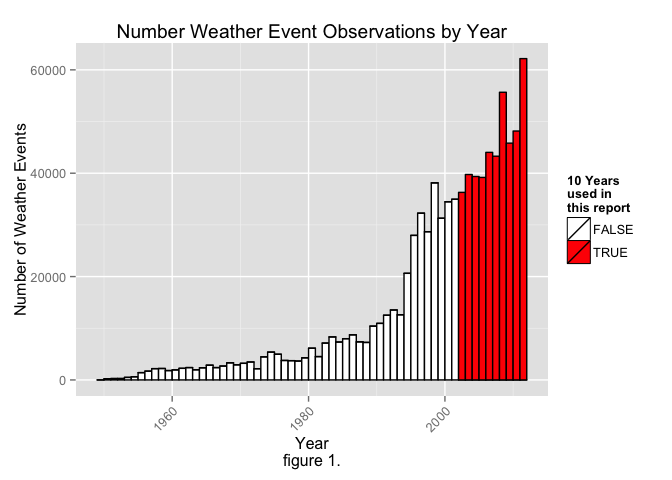
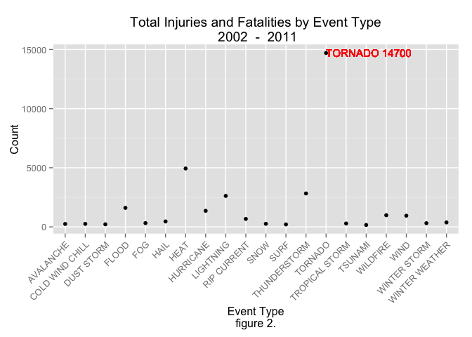
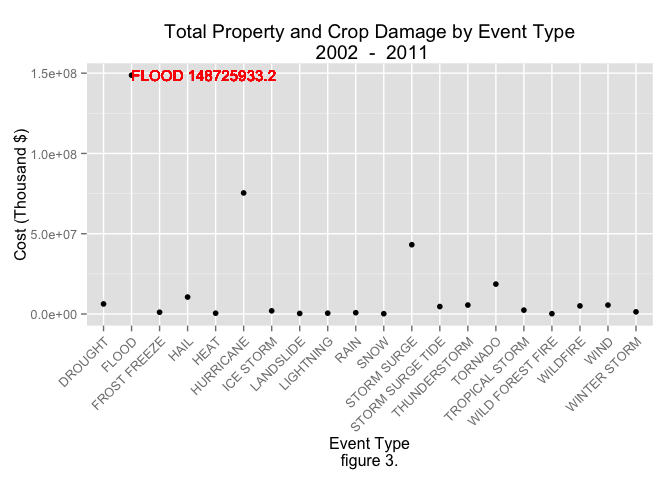

# 2002 - 2011 US Weather Effects on Population Health and the Economic Consequences

## Synopsis
In this report we aim to describe which type of US weather events are most
harmful to **population health** (injuries and fatalities) and which
have the greatest **economic consequences** (property and crop damage).

This report explores the NOAA Storm Database, calculating the total consequences
over a period of time.
Although the NOAA Storm Database contains records from
1950 - November 2011, we confirm that earlier years have fewer events recorded.
We decide to use the time period of the **last  10 years**,
which matches the chart interval used by National Weather Service -
[Natural Hazard Statistics](http://www.nws.noaa.gov/om/hazstats.shtml).

This report shows that **tornadoes** have the worst total effect on popluation health
while **flooding** inflicts the greatest economic consequences during this period.

--------------------------------------------------------------------------------

## Data Processing
The following R libraries are used.

```r
library(assertthat)
library(stringr)
library(dplyr)
```

```
## 
## Attaching package: 'dplyr'
## 
## The following object is masked from 'package:stats':
## 
##     filter
## 
## The following objects are masked from 'package:base':
## 
##     intersect, setdiff, setequal, union
```

```r
library(ggplot2)
```

### Reading in the data
We first read in the data from the csv file in the 47mb bzip2 compressed file
[Storm Data](https://d396qusza40orc.cloudfront.net/repdata%2Fdata%2FStormData.csv.bz2).
The data is comma separated, containing a header, and
missing values are coded as blank fields.

```r
storms.orig <- read.csv("data/repdata-data-StormData.csv.bz2", header=TRUE,
                        na.strings="", stringsAsFactors=FALSE)
```

After reading the data into `storms.orig` we see that there are
**902297** observations (rows) and 
**37** variables (columns) in this dataset.

```r
dim(storms.orig)
```

```
## [1] 902297     37
```

#### Exploring the data
We explore the first few rows in this dataset.  These documents help us find how some of the variables are constructed/defined.

  - National Weather Service [Storm Data Documentation](https://d396qusza40orc.cloudfront.net/repdata%2Fpeer2_doc%2Fpd01016005curr.pdf)
  - National Climatic Data Center Storm Events [FAQ](https://d396qusza40orc.cloudfront.net/repdata%2Fpeer2_doc%2FNCDC%20Storm%20Events-FAQ%20Page.pdf)


```r
head(storms.orig)
```

```
##   STATE__           BGN_DATE BGN_TIME TIME_ZONE COUNTY COUNTYNAME STATE
## 1       1  4/18/1950 0:00:00     0130       CST     97     MOBILE    AL
## 2       1  4/18/1950 0:00:00     0145       CST      3    BALDWIN    AL
## 3       1  2/20/1951 0:00:00     1600       CST     57    FAYETTE    AL
## 4       1   6/8/1951 0:00:00     0900       CST     89    MADISON    AL
## 5       1 11/15/1951 0:00:00     1500       CST     43    CULLMAN    AL
## 6       1 11/15/1951 0:00:00     2000       CST     77 LAUDERDALE    AL
##    EVTYPE BGN_RANGE BGN_AZI BGN_LOCATI END_DATE END_TIME COUNTY_END
## 1 TORNADO         0    <NA>       <NA>     <NA>     <NA>          0
## 2 TORNADO         0    <NA>       <NA>     <NA>     <NA>          0
## 3 TORNADO         0    <NA>       <NA>     <NA>     <NA>          0
## 4 TORNADO         0    <NA>       <NA>     <NA>     <NA>          0
## 5 TORNADO         0    <NA>       <NA>     <NA>     <NA>          0
## 6 TORNADO         0    <NA>       <NA>     <NA>     <NA>          0
##   COUNTYENDN END_RANGE END_AZI END_LOCATI LENGTH WIDTH F MAG FATALITIES
## 1         NA         0    <NA>       <NA>   14.0   100 3   0          0
## 2         NA         0    <NA>       <NA>    2.0   150 2   0          0
## 3         NA         0    <NA>       <NA>    0.1   123 2   0          0
## 4         NA         0    <NA>       <NA>    0.0   100 2   0          0
## 5         NA         0    <NA>       <NA>    0.0   150 2   0          0
## 6         NA         0    <NA>       <NA>    1.5   177 2   0          0
##   INJURIES PROPDMG PROPDMGEXP CROPDMG CROPDMGEXP  WFO STATEOFFIC ZONENAMES
## 1       15    25.0          K       0       <NA> <NA>       <NA>      <NA>
## 2        0     2.5          K       0       <NA> <NA>       <NA>      <NA>
## 3        2    25.0          K       0       <NA> <NA>       <NA>      <NA>
## 4        2     2.5          K       0       <NA> <NA>       <NA>      <NA>
## 5        2     2.5          K       0       <NA> <NA>       <NA>      <NA>
## 6        6     2.5          K       0       <NA> <NA>       <NA>      <NA>
##   LATITUDE LONGITUDE LATITUDE_E LONGITUDE_ REMARKS REFNUM
## 1     3040      8812       3051       8806    <NA>      1
## 2     3042      8755          0          0    <NA>      2
## 3     3340      8742          0          0    <NA>      3
## 4     3458      8626          0          0    <NA>      4
## 5     3412      8642          0          0    <NA>      5
## 6     3450      8748          0          0    <NA>      6
```

The `EVTYPE` event type variable will be needed to determine the weather event.
The `BGN_DATE` variable will be used to filter weather events by year.
Additionally, the following variables contain data useful for this report.

  - To determine population health, the following variables are needed:
    - `FATALITIES` - The number of direct or indirect fatalities attributable to the event.
    - `INJURIES` - The number of direct or indirect injuries attributable to the event.
  - Economic consequences:
    - `PROPDMG` - Property damage dollar amount
    - `PROPDMGEXP` - Property damage dollar amount magnitude (K, M, B, etc.)
    - `CROPDMG` - Crop damage dollar amount
    - `CROPDMGEXP` - Crop damage dollar amount magnitude (K, M, B, etc.)

#### Selecting dataset variables
Reducing the dataset to only those variables we are focusing on both helps
pre-eliminate non-essential values that we would have to otherwise visually
inspect later in the analysis and also improves subsequent computational performance.

`storms.df` will contain the reduced, cleaned, and tidied dataset used
throughout the remainder of the report.

```r
storms.df <- select(storms.orig,
                    EVTYPE, BGN_DATE, FATALITIES, INJURIES,
                    PROPDMG, PROPDMGEXP, CROPDMG, CROPDMGEXP)
dim(storms.df)
```

```
## [1] 902297      8
```
The number of variables used decreases from **37**
to **8**.

#### Filtering by year
The following histogram supports the claim that the earlier years of the database have generally fewer event records, most likely due to a lack of good records.
To investigate this, we filter by year, and create the `bgn_year` variable which contains the year extracted from `BGN_DATE`.

```r
storms.df <- mutate(storms.df, bgn_year=as.integer(format(strptime(storms.df$BGN_DATE, "%m/%d/%Y"), "%Y")))
max_year <- max(storms.df$bgn_year)
min_year <- max(min(storms.df$bgn_year), max_year - num_years + 1)
unique(storms.df$bgn_year)
```

```
##  [1] 1950 1951 1952 1953 1954 1955 1956 1957 1958 1959 1960 1961 1962 1963
## [15] 1964 1965 1966 1967 1968 1969 1970 1971 1972 1973 1974 1975 1976 1977
## [29] 1978 1979 1980 1981 1982 1983 1984 1985 1986 1987 1988 1989 1990 1991
## [43] 1992 1995 1994 1993 1996 1997 1998 1999 2000 2001 2002 2003 2004 2005
## [57] 2006 2007 2008 2009 2010 2011
```

```r
ggplot(storms.df, aes(x=bgn_year, fill=bgn_year >= min_year)) +
    ggtitle(paste("Number Weather Event Observations by Year")) +
    xlab("Year\nfigure 1.") + ylab("Number of Weather Events") +
    theme(axis.text.x=element_text(angle=45, vjust=1, hjust=1)) +
    scale_fill_manual(paste(num_years, "Years\nused in\nthis report"),
                      values=c("white", "red")) +
    geom_histogram(binwidth=1, color="black")
```

 

It looks like more records were kept from 1995 onwards.
We decide to use the time period of the **last 10**, which matches
the interval used by National Weather Service -
[Natural Hazard Statistics](http://www.nws.noaa.gov/om/hazstats.shtml).
Although 2011 only has records through November, we include 2011 nonetheless as
it has the most number of records for a year. `storms.df` is then subsetted accordingly.

```r
storms.df <- filter(storms.df, bgn_year >= min_year)
dim(storms.df)
```

```
## [1] 453730      9
```

#### Filtering by target variables
Reducing the dataset to only those observations where there are injures/fatalities
or property/crop damage also helps.

```r
storms.df <- filter(storms.df, FATALITIES>0 | INJURIES>0 | PROPDMG>0 | CROPDMG>0)
dim(storms.df)
```

```
## [1] 134528      9
```

The number of observations used decreases from the original **902297**
to finally **134528**.

#### Tidying Event Types
The previous subsetting transformations results in **79**
unique `EVTYPE` values we need to consider in the reduced `storms.df` dataset
versus the original **985** values in `storms.orig`.

```r
unique(storms.df$EVTYPE)
```

```
##  [1] "HAIL"                     "TSTM WIND"               
##  [3] "LIGHTNING"                "FLASH FLOOD"             
##  [5] "WINTER STORM"             "TORNADO"                 
##  [7] "HIGH WIND"                "RIP CURRENTS"            
##  [9] "TROPICAL STORM"           "HURRICANE"               
## [11] "AVALANCHE"                "FLOOD"                   
## [13] "WILD/FOREST FIRE"         "STORM SURGE"             
## [15] "ICE STORM"                "DUST STORM"              
## [17] "TSTM WIND/HAIL"           "HEAVY RAIN"              
## [19] "EXCESSIVE HEAT"           "URBAN/SML STREAM FLD"    
## [21] "FOG"                      "HEAVY SURF"              
## [23] "HIGH SURF"                "EXTREME COLD"            
## [25] "WIND"                     "HAZARDOUS SURF"          
## [27] "WINTER WEATHER MIX"       "HEAVY SNOW"              
## [29] "SMALL HAIL"               "BLIZZARD"                
## [31] "WILDFIRE"                 "STRONG WIND"             
## [33] "DRY MICROBURST"           "COLD WEATHER"            
## [35] "WHIRLWIND"                "COASTAL FLOODING"        
## [37] "DROUGHT"                  "STRONG WINDS"            
## [39] "ICE ON ROAD"              "DUST DEVIL"              
## [41] "SNOW SQUALLS"             "LIGHT SNOW"              
## [43] "SEICHE"                   "MIXED PRECIPITATION"     
## [45] "ROUGH SEAS"               "SNOW"                    
## [47] "GUSTY WINDS"              "DROWNING"                
## [49] "EXTREME COLD/WIND CHILL"  "MARINE TSTM WIND"        
## [51] "WATERSPOUT"               "HIGH SEAS"               
## [53] "RIP CURRENT"              "HURRICANE/TYPHOON"       
## [55] "LANDSLIDE"                "DENSE FOG"               
## [57] "WINTER WEATHER/MIX"       "FROST/FREEZE"            
## [59] "ASTRONOMICAL HIGH TIDE"   "EXTREME WINDCHILL"       
## [61] "HEAVY SURF/HIGH SURF"     "TROPICAL DEPRESSION"     
## [63] "COASTAL FLOOD"            "FUNNEL CLOUD"            
## [65] "LAKE-EFFECT SNOW"         "WINTER WEATHER"          
## [67] "MARINE HIGH WIND"         "THUNDERSTORM WIND"       
## [69] "HEAT"                     "TSUNAMI"                 
## [71] "STORM SURGE/TIDE"         "COLD/WIND CHILL"         
## [73] "LAKESHORE FLOOD"          "MARINE THUNDERSTORM WIND"
## [75] "MARINE STRONG WIND"       "ASTRONOMICAL LOW TIDE"   
## [77] "DENSE SMOKE"              "MARINE HAIL"             
## [79] "FREEZING FOG"
```

Still, there are many event types.  Through visual inspection, we'll now attempt
to somewhat normalize them while retaining a reasonable level of fidelity.
The code below shows the series of transformations used.
The `normEVTYPE` variable in `storms.df` stores these values.

```r
normEVTYPE <- storms.df$EVTYPE

# Upper case all
normEVTYPE <- toupper(normEVTYPE)

# Replace special characters /, (, ), ., \, &, - with space
normEVTYPE <- gsub("/|\\(|\\)|\\.|\\\\|\\&|\\-", " ", normEVTYPE)

# Remove numeric F, G, or numeric magnitudes
normEVTYPE <- gsub("[F|G]\\d+", " ", normEVTYPE)
normEVTYPE <- gsub("\\d+", " ", normEVTYPE)

# Remove plurality
normEVTYPE <- gsub("RAINS\\s", "RAIN ", normEVTYPE)
normEVTYPE <- gsub("STORMS", "STORM", normEVTYPE)
normEVTYPE <- gsub("WINDS", "WIND", normEVTYPE)
normEVTYPE <- gsub("FLOODS", "FLOOD", normEVTYPE)
normEVTYPE <- gsub("CURRENTS", "CURRENT", normEVTYPE)

# Remove adjectives
normEVTYPE <- gsub("HARD |HIGH |LOW |SEVERE |HEAVY |EXCESSIVE |EXTREME |STRONG |LIGHT |DENSE | INJURY", " ", normEVTYPE)

# Any tornado becomes tornado
normEVTYPE <- gsub("TORNADOES|TORNDAO", "TORNADO", normEVTYPE)
normEVTYPE <- gsub(".*TORNADO.*", "TORNADO", normEVTYPE)

# Any hurricane becomes hurricane
normEVTYPE <- gsub(".*HURRICANE.*", "HURRICANE", normEVTYPE)

# Any thunderstorm becomes thunderstorm
normEVTYPE <- gsub("TSTM|THUNERSTORM|TUNDERSTORM|THUDERSTORM|THUNDERTORM|THUNDEERSTORM", "THUNDERSTORM", normEVTYPE)
normEVTYPE <- gsub(".*THUNDERSTORM.*", "THUNDERSTORM", normEVTYPE)

# Snow
normEVTYPE <- gsub("SNOWFALL", "SNOW", normEVTYPE)

# Trim adjacent whitespace
normEVTYPE <- gsub("\\s+", " ", normEVTYPE)

# Trim leading and trailing blanks
normEVTYPE <- str_trim(normEVTYPE)

storms.df$normEVTYPE <- normEVTYPE
```

The number of unique types has been reduced to a final count of
**61**.

```r
unique(normEVTYPE)
```

```
##  [1] "HAIL"                 "THUNDERSTORM"         "LIGHTNING"           
##  [4] "FLASH FLOOD"          "WINTER STORM"         "TORNADO"             
##  [7] "WIND"                 "RIP CURRENT"          "TROPICAL STORM"      
## [10] "HURRICANE"            "AVALANCHE"            "FLOOD"               
## [13] "WILD FOREST FIRE"     "STORM SURGE"          "ICE STORM"           
## [16] "DUST STORM"           "RAIN"                 "HEAT"                
## [19] "URBAN SML STREAM FLD" "FOG"                  "SURF"                
## [22] "COLD"                 "HAZARDOUS SURF"       "WINTER WEATHER MIX"  
## [25] "SNOW"                 "SMALL HAIL"           "BLIZZARD"            
## [28] "WILDFIRE"             "DRY MICROBURST"       "COLD WEATHER"        
## [31] "WHIRLWIND"            "COASTAL FLOODING"     "DROUGHT"             
## [34] "ICE ON ROAD"          "DUST DEVIL"           "SNOW SQUALLS"        
## [37] "SEICHE"               "MIXED PRECIPITATION"  "ROUGH SEAS"          
## [40] "GUSTY WIND"           "DROWNING"             "COLD WIND CHILL"     
## [43] "WATERSPOUT"           "SEAS"                 "LANDSLIDE"           
## [46] "FROST FREEZE"         "ASTRONOMICAL TIDE"    "WINDCHILL"           
## [49] "SURF SURF"            "TROPICAL DEPRESSION"  "COASTAL FLOOD"       
## [52] "FUNNEL CLOUD"         "LAKE EFFECT SNOW"     "WINTER WEATHER"      
## [55] "MARINE WIND"          "TSUNAMI"              "STORM SURGE TIDE"    
## [58] "LAKESHORE FLOOD"      "SMOKE"                "MARINE HAIL"         
## [61] "FREEZING FOG"
```


--------------------------------------------------------------------------------

## Results

### Injuries and Fatalities
Copy and filter the reduced `storms.df` dataset to only those observations where
there is an injury or fatality and store it in `human.df`.

```r
human.df <- storms.df[storms.df$FATALITIES>0 | storms.df$INJURIES>0, ]
```

Summarize the injuries and fatalities by event type and store it in `human.summary`.

```r
human.summary <- human.df %>%
    group_by(normEVTYPE) %>%
    summarise(souls=sum(INJURIES, FATALITIES))
dim(human.summary)
```

```
## [1] 45  2
```

There are a total of **34657** combined
injuries and fatalities during the time period.

There are **45** different normalized event types;
Since this report focuses on the events with the worst impacts, and not all,
I've decided to only look at the **top  20** for this report.

```r
top_n <- 20
human.top_summary <- top_n(human.summary, top_n, souls)
arrange(human.top_summary, desc(souls))
```

```
## Source: local data frame [20 x 2]
## 
##         normEVTYPE souls
## 1          TORNADO 14700
## 2             HEAT  4939
## 3     THUNDERSTORM  2826
## 4        LIGHTNING  2620
## 5        HURRICANE  1358
## 6      FLASH FLOOD  1056
## 7         WILDFIRE   986
## 8             WIND   946
## 9      RIP CURRENT   674
## 10           FLOOD   548
## 11            HAIL   459
## 12  WINTER WEATHER   376
## 13             FOG   320
## 14    WINTER STORM   313
## 15  TROPICAL STORM   288
## 16            SNOW   262
## 17 COLD WIND CHILL   256
## 18       AVALANCHE   248
## 19      DUST STORM   218
## 20            SURF   210
```

Plot `human.top_summary` and notice the event with the worst impact.

```r
# Find event with worst impact
index <- which.max(human.top_summary$souls)
evtype <- human.top_summary$normEVTYPE[index]
cnt <- human.top_summary$souls[index]

# Plot
ggplot(human.top_summary, aes(x=normEVTYPE, y=souls)) +
  ggtitle(paste("Total Injuries and Fatalities by Event Type\n",
                min_year, " - ", max_year)) +
  xlab("Event Type\nfigure 2.") + ylab("Count") +
  theme(axis.text.x=element_text(angle=45, vjust=1, hjust=1)) +
  geom_point() +
  geom_text(hjust=0, yjust=0, size=4, color="red",
            aes(label=paste(evtype, cnt),
                x=human.top_summary$normEVTYPE[index], y=cnt))
```

 

**TORNADO** had a total of **1.47\times 10^{4}** combined injuries and
fatalities from **2002** - **2011**.


### Property and Crop Damage
Copy and filter the reduced `storms.df` dataset to only those observations where
there is property or crop damage and store it in `damage.df`.

```r
damage.df <- storms.df[storms.df$PROPDMG>0 | storms.df$CROPDMG>0, ]
dim(damage.df)
```

```
## [1] 130682     10
```

```r
head(damage.df)
```

```
##      EVTYPE         BGN_DATE FATALITIES INJURIES PROPDMG PROPDMGEXP
## 1      HAIL 6/4/2002 0:00:00          0        0       2          K
## 2 TSTM WIND 6/4/2002 0:00:00          0        0       2          K
## 3 LIGHTNING 6/4/2002 0:00:00          0        1       3          K
## 4 TSTM WIND 6/4/2002 0:00:00          0        1       5          K
## 5 TSTM WIND 6/4/2002 0:00:00          0        0       2          K
## 7 TSTM WIND 6/4/2002 0:00:00          0        0       4          K
##   CROPDMG CROPDMGEXP bgn_year   normEVTYPE
## 1       0          K     2002         HAIL
## 2       0          K     2002 THUNDERSTORM
## 3       0          K     2002    LIGHTNING
## 4       0          K     2002 THUNDERSTORM
## 5       0          K     2002 THUNDERSTORM
## 7       0          K     2002 THUNDERSTORM
```

Before we can create a table that summarizes the damage costs, we need to compute
normalized costs from `damage.df$PROPDMG`/`damage.df$PROPDMGEXP` and
`damage.df$CROPDMG`/`damage.df$CROPDMGEXP`.
Some of the EXP units are in lower case, so upper case them all.

```r
damage.df$PROPDMGEXP <- toupper(damage.df$PROPDMGEXP)
damage.df$CROPDMGEXP <- toupper(damage.df$CROPDMGEXP)
unique(damage.df$PROPDMGEXP)
```

```
## [1] "K" "M" NA  "B"
```

```r
unique(damage.df$CROPDMGEXP)
```

```
## [1] "K" NA  "M" "B"
```

The code below computes each observation's total cost in units of thousands
of dollars in a new `kcost` variable in `damage.df`.
Per page section 2.7 of [Storm Data Documentation](https://d396qusza40orc.cloudfront.net/repdata%2Fpeer2_doc%2Fpd01016005curr.pdf), K = thousands, M = millions,
and B = billions.
In prior years there were also rogue EXP units some of which were numeric
(treated as base 10 exponents).
I've decided to treat all others as K since that's the smallest EXP unit from section 2.7.

```r
# Damage cost in thousands $
kcost <- function(dmg, exp) {
  if (dmg > 0 && !is.na(exp)) {
    if        (exp=="3"|exp=="K") { return(dmg)
    } else if (exp=="4")          { return(dmg * 10)
    } else if (exp=="5")          { return(dmg * 100)
    } else if (exp=="6"|exp=="M") { return(dmg * 1000)
    } else if (exp=="7")          { return(dmg * 10000)
    } else if (exp=="B")          { return(dmg * 1000000)
    } else                        { return(dmg) # Assume thousands
    }
  }
  return(dmg)
}

damage.df <- mutate(damage.df, kcost=0)
for (i in 1:nrow(damage.df)) {
  row <- damage.df[i,]  
  k1 <- kcost(row["PROPDMG"], row["PROPDMGEXP"])
  k2 <- kcost(row["CROPDMG"], row["CROPDMGEXP"]) 
  damage.df[i, "kcost"] <- k1 + k2
}
```

Summarize the property and crop damage by event type and store it in `damage.summary`.

```r
damage.summary <- damage.df %>%
    group_by(normEVTYPE) %>%
    summarise(kcost=sum(kcost))
dim(damage.summary)
```

```
## [1] 55  2
```
There are a total of **333599496.23** (thousand $)
property and crop damage costs during the time period.

There are **55** different normalized event types.
Since this report focuses on the events with the worst impacts, and **not** all,
I've decided to only look at the **top  20** for this report.

```r
damage.top_summary <- top_n(damage.summary, top_n, kcost)
arrange(damage.top_summary, desc(kcost))
```

```
## Source: local data frame [20 x 2]
## 
##          normEVTYPE       kcost
## 1             FLOOD 136979555.9
## 2         HURRICANE  75399077.8
## 3       STORM SURGE  43168315.0
## 4           TORNADO  18627512.6
## 5       FLASH FLOOD  11521916.7
## 6              HAIL  10567565.4
## 7           DROUGHT   6269583.0
## 8      THUNDERSTORM   5576479.3
## 9              WIND   5567219.4
## 10         WILDFIRE   5054139.8
## 11 STORM SURGE TIDE   4642038.0
## 12   TROPICAL STORM   2418421.5
## 13        ICE STORM   1973382.8
## 14     WINTER STORM   1351051.2
## 15     FROST FREEZE   1103566.0
## 16             RAIN    819469.5
## 17        LIGHTNING    515593.0
## 18             HEAT    498501.7
## 19        LANDSLIDE    344095.0
## 20    COASTAL FLOOD    216820.6
```

Plot `damage.top_summary` and notice the event with the worst impact.

```r
# Find event with worst impact
index <- which.max(damage.top_summary$kcost)
evtype <- damage.top_summary$normEVTYPE[index]
cnt <- damage.top_summary$kcost[index]

# Plot
ggplot(damage.top_summary, aes(x=normEVTYPE, y=kcost)) +
  ggtitle(paste("Total Property and Crop Damage by Event Type\n",
                min_year, " - ", max_year)) +
  xlab("Event Type\nfigure 3.") + ylab("Cost (Thousand $)") +
  theme(axis.text.x=element_text(angle=45, vjust=1, hjust=1)) +
  geom_point() +
  geom_text(hjust=0, yjust=0, size=4, color="red",
            aes(label=paste(evtype, cnt),
                x=damage.top_summary$normEVTYPE[index], y=cnt))
```

 

**FLOOD** had a total of **1.3697956\times 10^{8}** (thousand $)
combined property and crop damage from **2002** - **2011**.
